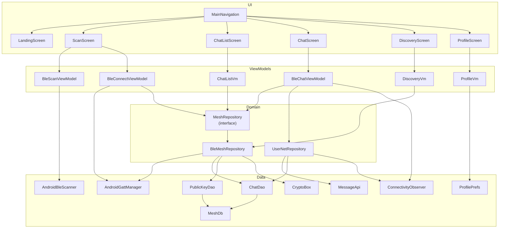

```mermaid
flowchart TB
  %% UI Layer
  subgraph UI
    MN[MainNavigation]
    LS[LandingScreen]
    SC[ScanScreen]
    CL[ChatListScreen]
    CH[ChatScreen]
    DS[DiscoveryScreen]
    PS[ProfileScreen]
  end

  %% ViewModel Layer
  subgraph ViewModels
    BSV[BleScanViewModel]
    BCV[BleConnectViewModel]
    CLV[ChatListVm]
    DV[DiscoveryVm]
    CHV[BleChatViewModel]
    PV[ProfileVm]
  end

  %% Domain / Repositories
  subgraph Domain
    MR["MeshRepository\n(interface)"]
    BMR[BleMeshRepository]
    UNR[UserNetRepository]
  end

  %% Data Layer
  subgraph Data
    GMgr[AndroidGattManager]
    BScan[AndroidBleScanner]
    DB[MeshDb]
    CD[ChatDao]
    PK[PublicKeyDao]
    CB[CryptoBox]
    CO[ConnectivityObserver]
    API[MessageApi]
    PP[ProfilePrefs]
  end

  %% UI → Navigation
  MN --> LS
  MN --> SC
  MN --> CL
  MN --> CH
  MN --> DS
  MN --> PS

  %% Screens → VMs
  SC --> BSV
  SC --> BCV
  CL --> CLV
  DS --> DV
  CH --> CHV
  PS --> PV

  %% VMs → Repos / Services
  BSV --> BScan
  BCV --> GMgr
  BCV --> MR
  CLV --> MR
  DV  --> BMR
  CHV --> MR
  CHV --> UNR
  CHV --> CO
  PV  --> PP

  %% Domain interface → implementations
  MR  --> BMR
  BMR --> GMgr
  BMR --> CD
  BMR --> PK
  BMR --> CB
  UNR --> API
  UNR --> CD
  UNR --> CO

  %% DAOs → Database
  CD  --> DB
  PK  --> DB


```