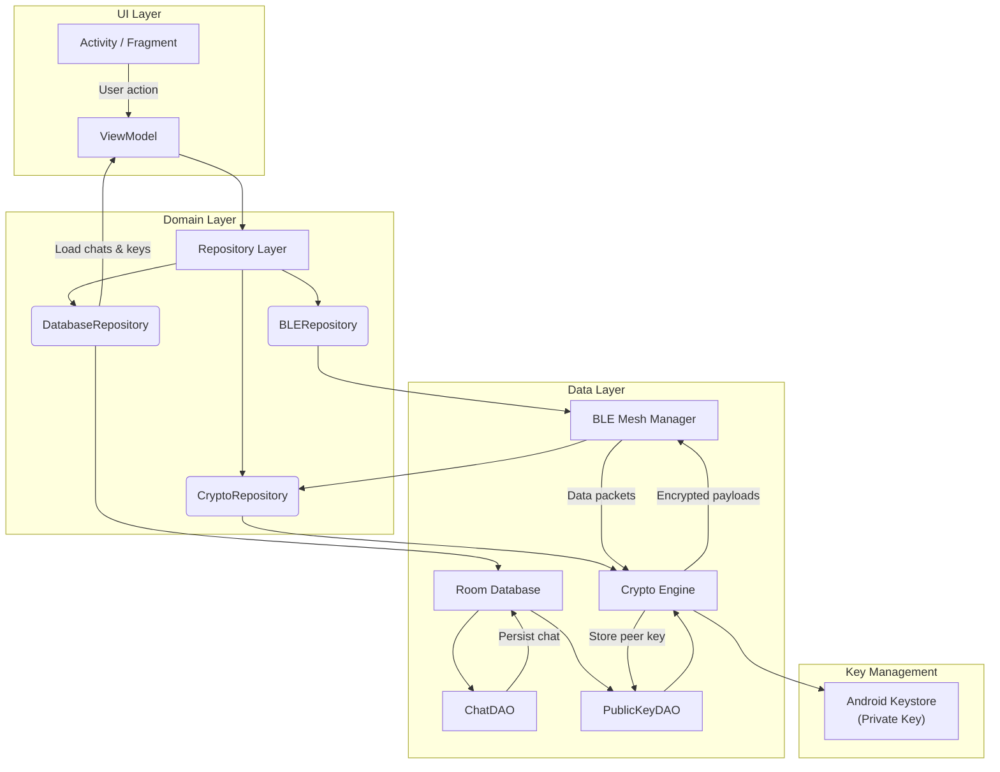

```mermaid
flowchart TD
  subgraph UI Layer
    A[Activity / Fragment]
    B[ViewModel]
  end

  subgraph Domain Layer
    B --> C[Repository Layer]
    C --> D(BLERepository)
    C --> E(CryptoRepository)
    C --> F(DatabaseRepository)
  end

  subgraph Data Layer
    D --> G[BLE Mesh Manager]
    E --> H[Crypto Engine]
    F --> I[Room Database]
    I --> J[ChatDAO]
    I --> K[PublicKeyDAO]
  end

  subgraph Key Management
    H --> L["Android Keystore\n(Private Key)"]
    K --> H
    G --> E
  end

  %% Flows
  A -->|User action| B
  G -->|Data packets| H
  H -->|Encrypted payloads| G
  H -->|Store peer key| K
  J -->|Persist chat| I
  F -->|Load chats & keys| B


```