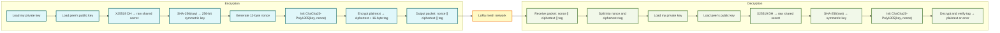

```mermaid
flowchart LR
  subgraph Encryption
    direction TB
    E1["Load my private key"] --> E2["Load peer's public key"]
    E2 --> E3["X25519 DH → raw shared secret"]
    E3 --> E4["SHA-256(raw) → 256-bit symmetric key"]
    E4 --> E5["Generate 12-byte nonce"]
    E5 --> E6["Init ChaCha20-Poly1305(key, nonce)"]
    E6 --> E7["Encrypt plaintext → ciphertext + 16-byte tag"]
    E7 --> E8["Output packet: nonce ∥ ciphertext ∥ tag"]
  end

  E8 --> M["LoRa mesh network"]
  M  --> D1

  subgraph Decryption
    direction BT
    D1["Receive packet: nonce ∥ ciphertext ∥ tag"] --> D2["Split into nonce and ciphertext+tag"]
    D2 --> D3["Load my private key"]
    D3 --> D4["Load peer's public key"]
    D4 --> D5["X25519 DH → raw shared secret"]
    D5 --> D6["SHA-256(raw) → symmetric key"]
    D6 --> D7["Init ChaCha20-Poly1305(key, nonce)"]
    D7 --> D8["Decrypt and verify tag → plaintext or error"]
  end

  %% colour definitions
  classDef enc fill:#e0f7fa,stroke:#006064,stroke-width:2px;
  classDef net fill:#fff9c4,stroke:#f57f17,stroke-width:2px;
  classDef dec fill:#f1f8e9,stroke:#33691e,stroke-width:2px;
  class E1,E2,E3,E4,E5,E6,E7,E8 enc;
  class M net;
  class D1,D2,D3,D4,D5,D6,D7,D8 dec;

```