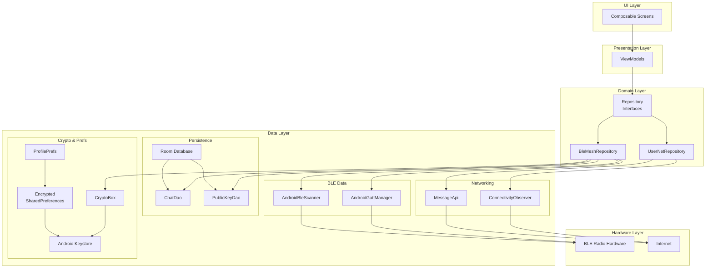

```mermaid
flowchart TB
  %% UI & Presentation
  subgraph UI Layer
    UI[Composable Screens]
  end
  subgraph Presentation Layer
    VM[ViewModels]
  end

  %% Domain
  subgraph Domain Layer
    direction LR
    RI["Repository\nInterfaces"]
    BMR[BleMeshRepository]
    UNR[UserNetRepository]
    RI --> BMR
    RI --> UNR
  end

  %% Data (non-hardware infra)
  subgraph Data Layer
    direction LR

    subgraph BLE Data
      direction TB
      Scanner[AndroidBleScanner]
      GATT[AndroidGattManager]
    end

    subgraph Persistence
      direction TB
      DB[Room Database]
      ChatDao[ChatDao]
      PKDao[PublicKeyDao]
      DB --> ChatDao
      DB --> PKDao
    end

    subgraph Crypto & Prefs
      direction TB
      CryptoBox[CryptoBox]
      Prefs[ProfilePrefs]
      SharedPrefs[Encrypted\nSharedPreferences]
      Keystore[Android Keystore]
      Prefs --> SharedPrefs
      SharedPrefs --> Keystore
      CryptoBox --> Keystore
    end

    subgraph Networking
      direction TB
      API[MessageApi]
      Conn[ConnectivityObserver]
    end
  end

  %% Hardware
  subgraph Hardware Layer
    direction LR
    BLERadio[BLE Radio Hardware]
    Internet[Internet]
  end

  %% Wiring
  UI --> VM
  VM --> RI

  BMR --> Scanner
  BMR --> GATT
  Scanner --> BLERadio
  GATT --> BLERadio

  BMR --> ChatDao
  BMR --> PKDao
  BMR --> CryptoBox

  UNR --> API
  UNR --> Conn
  API --> Internet
  Conn --> Internet

```