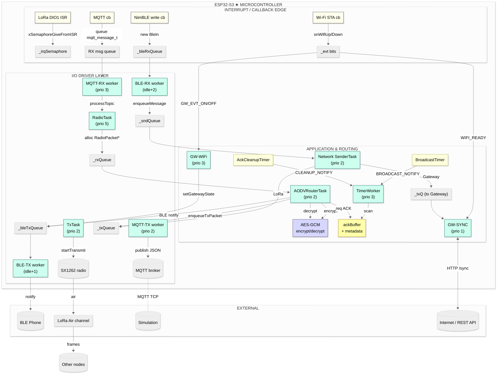

```mermaid
---
config:
  look: neo
  layout: dagre
  themeVariables:
    fontSize: 20px
    fontFamily: Arial
  theme: neutral
---
flowchart TD
 subgraph ISR["INTERRUPT / CALLBACK EDGE"]
    direction LR
        IRQSEM["_irqSemaphore"]
        DIO1ISR["LoRa DIO1 ISR"]
        BLE_RX_Q["_bleRxQueue"]
        BLEw["NimBLE write cb"]
        EVT["_evt bits"]
        WIFI["Wi-Fi STA cb"]
        MQTT_IN_Q["RX msg queue"]
        MQTTCB["MQTT cb"]
  end
 subgraph DRV["I/O DRIVER LAYER"]
    direction TB
        RadioTask["RadioTask<br>(prio 5)"]
        TxTask["TxTask<br>(prio 2)"]
        BLE_RxTask["BLE-RX worker<br>(idle+2)"]
        BLE_TxTask["BLE-TX worker<br>(idle+1)"]
        MQTT_Rx["MQTT-RX worker<br>(prio 3)"]
        MQTT_Tx["MQTT-TX worker<br>(prio 2)"]
        RXQ["_rxQueue"]
        TXQ["_txQueue"]
        BLE_TX_Q[" _bleTxQueue"]
        SNDQ["_sndQueue"]
        LoRaHW[("SX1262 radio")]
        Broker[("MQTT broker")]
  end
 subgraph APP["APPLICATION & ROUTING"]
    direction TB
        RouterTask["AODVRouterTask<br>(prio 2)"]
        ENC["AES-GCM<br>encrypt/decrypt"]
        ACKBUF["ackBuffer<br>+ metadata"]
        TimerWkr["TimerWorker<br>(prio 3)"]
        SenderTask["Network SenderTask<br>(prio 2)"]
        GW_SYNC["GW-SYNC<br>(prio 1)"]
        GW_WIFI["GW-WiFi<br>(prio 3)"]
        BCAST_T["BroadcastTimer"]
        ACK_T["AckCleanupTimer"]
        GW_TX_Q[" _txQ (to Gateway)"]
  end
 subgraph MCU["ESP32-S3  ★  MICROCONTROLLER"]
    direction TB
        ISR
        DRV
        APP
  end
 subgraph EXT["EXTERNAL"]
    direction TB
        Phone[("BLE Phone")]
        Air["LoRa Air channel"]
        Sim[("Simulation")]
        Net[("Internet / REST API")]
  end
    GW_WIFI -- setGatewayState --> BLE_TX_Q
    DIO1ISR -- xSemaphoreGiveFromISR --> IRQSEM
    BLEw -- new BleIn --> BLE_RX_Q
    WIFI -- onWifiUp/Down --> EVT
    MQTTCB -- queue mqtt_message_t --> MQTT_IN_Q
    BLE_RX_Q --> BLE_RxTask
    BLE_RxTask -- enqueueMessage --> SNDQ
    MQTT_IN_Q --> MQTT_Rx
    MQTT_Rx -- processTopic --> RadioTask
    RadioTask -- alloc RadioPacket* --> RXQ
    TxTask -- startTransmit --> LoRaHW
    BLE_TX_Q --> BLE_TxTask
    MQTT_Tx -- publish JSON --> Broker
    RXQ --> RouterTask
    RouterTask -- decrypt --> ENC
    RouterTask -- encrypt --> ENC
    RouterTask -- enqueueTxPacket --> TXQ
    RouterTask -- BLE notify --> BLE_TX_Q
    RouterTask -- req ACK --> ACKBUF
    TimerWkr -- scan --> ACKBUF
    ACK_T -- CLEANUP_NOTIFY --> TimerWkr
    BCAST_T -- BROADCAST_NOTIFY --> TimerWkr
    SNDQ --> SenderTask
    SenderTask -- LoRa --> TXQ
    SenderTask -- Gateway --> GW_TX_Q
    GW_TX_Q --> GW_SYNC
    EVT -- WIFI_READY --> GW_SYNC
    EVT -- GW_EVT_ON/OFF --> GW_WIFI
    Broker -. MQTT TCP .- Sim
    LoRaHW -- air --> Air
    BLE_TxTask -- notify --> Phone
    Air -- frames --> OtherMesh[("Other nodes")]
    GW_SYNC <-- HTTP /sync --> Net
    %% Net -. downlink JSON .- GW_SYNC
     DIO1ISR:::isr
     BLEw:::isr
     WIFI:::isr
     MQTTCB:::isr
     RadioTask:::task
     TxTask:::task
     BLE_RxTask:::task
     BLE_TxTask:::task
     MQTT_Rx:::task
     MQTT_Tx:::task
     RouterTask:::task
     ENC:::crypto
     ACKBUF:::data
     TimerWkr:::task
     SenderTask:::task
     GW_SYNC:::task
     GW_WIFI:::task
     BCAST_T:::timer
     ACK_T:::timer
    classDef task   fill:#cfe,stroke:#055,stroke-width:1px
    classDef timer  fill:#ffd,stroke:#aa4,stroke-width:1px
    classDef isr    fill:#ffe,stroke:#333,stroke-width:1px
    classDef crypto fill:#d6d6ff,stroke:#435,stroke-width:1px
    classDef data   fill:#ffa,stroke:#a60,stroke-width:1px
```