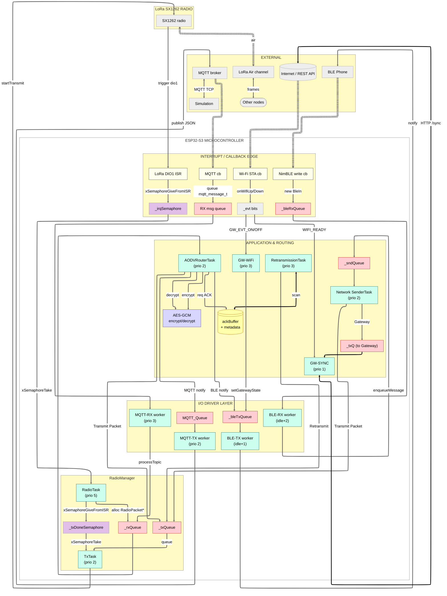

```mermaid
---
config:
  look: classic
  layout: elk
  themeVariables:
    fontSize: 20px
    fontFamily: Arial
  theme: neutral
---
flowchart TD
 subgraph ISR["INTERRUPT / CALLBACK EDGE"]
    direction LR
        IRQSEM["_irqSemaphore"]
        DIO1ISR["LoRa DIO1 ISR"]
        BLE_RX_Q["_bleRxQueue"]
        BLEw["NimBLE write cb"]
        EVT["_evt bits"]
        WIFI["Wi-Fi STA cb"]
        MQTT_IN_Q["RX msg queue"]
        MQTTCB["MQTT cb"]
  end
 subgraph RM["RadioManager"]
    direction TB
        TXDONESEM["_txDoneSemaphore"]
        RXQ["_rxQueue"]
        TXQ["_txQueue"]
        RadioTask["RadioTask<br>(prio 5)"]
        TxTask["TxTask<br>(prio 2)"]
  end
 subgraph DRV["I/O DRIVER LAYER"]
    direction TB
        BLE_TxTask["BLE-TX worker<br>(idle+1)"]
        MQTT_Rx["MQTT-RX worker<br>(prio 3)"]
        MQTT_TX_Q["MQTT_Queue"]
        MQTT_Tx["MQTT-TX worker<br>(prio 2)"]
        BLE_TX_Q["_bleTxQueue"]
        BLE_RxTask["BLE-RX worker<br>(idle+2)"]
  end
 subgraph APP["APPLICATION &amp; ROUTING"]
    direction TB
        SNDQ["_sndQueue"]
        RouterTask["AODVRouterTask<br>(prio 2)"]
        ENC["AES-GCM<br>encrypt/decrypt"]
        ACKBUF["ackBuffer<br>+ metadata"]
        ReTxWkr["RetransmissionTask<br>(prio 3)"]
        SenderTask["Network SenderTask<br>(prio 2)"]
        GW_SYNC["GW-SYNC<br>(prio 1)"]
        GW_WIFI["GW-WiFi<br>(prio 3)"]
        GW_TX_Q["_txQ (to Gateway)"]
  end
 subgraph MCU["ESP32-S3 MICROCONTROLLER"]
    direction TB
        ISR
        DRV
        APP
        RM
  end
 subgraph HW["LoRa SX1262 RADIO"]
    direction TB
        LoRaHW["SX1262 radio"]
  end
 subgraph EXT["EXTERNAL"]
    direction TB
        Broker["MQTT broker"]
        Sim["Simulation"]
        Air["LoRa Air channel"]
        Phone["BLE Phone"]
        Net[("Internet / REST API")]
        OtherMesh(["Other nodes"])
  end
    DIO1ISR == xSemaphoreGiveFromISR ==> IRQSEM
    MQTTCB == queue mqtt_message_t ==> MQTT_IN_Q
    WIFI == onWifiUp/Down ==> EVT
    Broker -.-> MQTTCB
    Phone -.-> BLEw
    Net -.-> WIFI
    IRQSEM == xSemaphoreTake ==> RadioTask
    RadioTask == alloc RadioPacket* ==> RXQ
    RadioTask == xSemaphoreGiveFromISR ==> TXDONESEM
    TXDONESEM == xSemaphoreTake ==> TxTask
    BLEw == new BleIn ==> BLE_RX_Q
    BLE_RX_Q ==> BLE_RxTask
    BLE_RxTask == enqueueMessage ==> SNDQ
    MQTT_IN_Q ==> MQTT_Rx
    MQTT_Rx == processTopic ==> RXQ
    RXQ ==> RouterTask
    RouterTask == decrypt ==> ENC
    RouterTask == encrypt ==> ENC
    RouterTask == Transmit Packet ==> TXQ
    ReTxWkr == Retransmit ==> TXQ
    RouterTask == BLE notify ==> BLE_TX_Q
    RouterTask == MQTT notify ==> MQTT_TX_Q
    MQTT_TX_Q ==> MQTT_Tx
    RouterTask == req ACK ==> ACKBUF
    ReTxWkr <== scan ==> ACKBUF
    SNDQ ==> SenderTask
    SenderTask == Transmit Packet ==> TXQ
    SenderTask == Gateway ==> GW_TX_Q
    BLE_TxTask == notify ==> Phone
    BLE_TX_Q ==> BLE_TxTask
    MQTT_Tx == publish JSON ==> Broker
    Broker <== MQTT TCP ==> Sim
    GW_TX_Q ==> GW_SYNC
    EVT == WIFI_READY ==> GW_SYNC
    EVT == GW_EVT_ON/OFF ==> GW_WIFI
    GW_WIFI == setGatewayState ==> BLE_TX_Q
    GW_SYNC <== HTTP /sync ==> Net
    TXQ == queue ==> TxTask
    TxTask == startTransmit ==> LoRaHW
    LoRaHW == trigger dio1 ==> DIO1ISR
    LoRaHW <-. air .-> Air
    Air <== frames ==> OtherMesh
    ACKBUF@{ shape: disk}
    LoRaHW@{ shape: rect}
    Broker@{ shape: rect}
    Sim@{ shape: proc}
    Phone@{ shape: rect}
     DIO1ISR:::isr
     BLE_RX_Q:::queue
     BLEw:::isr
     WIFI:::isr
     MQTT_IN_Q:::queue
     MQTTCB:::isr
     RXQ:::queue
     TXQ:::queue
     RadioTask:::task
     TxTask:::task
     BLE_TxTask:::task
     MQTT_Rx:::task
     MQTT_TX_Q:::queue
     MQTT_Tx:::task
     BLE_TX_Q:::queue
     BLE_RxTask:::task
     SNDQ:::queue
     RouterTask:::task
     ENC:::crypto
     ACKBUF:::data
     ReTxWkr:::task
     SenderTask:::task
     GW_SYNC:::task
     GW_WIFI:::task
     GW_TX_Q:::queue
    classDef task   fill:#cfe,stroke:#055,stroke-width:1px
    classDef isr    fill:#ffe,stroke:#333,stroke-width:1px
    classDef crypto fill:#d6d6ff,stroke:#435,stroke-width:1px
    classDef data   fill:#ffa,stroke:#a60,stroke-width:1px
    classDef queue fill:#FFCDD2, stroke:#D50000,stroke-width:1x
    style IRQSEM fill:#E1BEE7
    style TXDONESEM fill:#E1BEE7
    style ISR fill:#FFF9C4
    style DRV fill:#FFF9C4
    style APP fill:#FFF9C4
    style RM fill:#FFF9C4
    style EXT fill:#FFF9C4
    style HW fill:#FFF9C4
    style MCU fill:#FFFFFF
    linkStyle 3 stroke-width:10px,fill:none
    linkStyle 4 stroke-width:10px,fill:none
    linkStyle 5 stroke-width:10px,fill:none
    linkStyle 24 stroke:#000000, fill:none,fill:none
    linkStyle 32 stroke:#000000,fill:none
    linkStyle 36 stroke:#000000,fill:none
    linkStyle 40 stroke-width:10px,fill:none


```