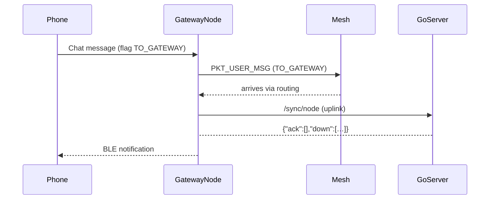

```mermaid
sequenceDiagram
    participant Phone
    participant GatewayNode
    participant Mesh
    participant GoServer
    Phone->>GatewayNode: Chat message (flag TO_GATEWAY)
    GatewayNode->>Mesh: PKT_USER_MSG (TO_GATEWAY)
    Mesh-->>GatewayNode: arrives via routing
    GatewayNode->>GoServer: /sync/node (uplink)
    GoServer-->GatewayNode: {"ack":[],"down":[…]}
    GatewayNode-->>Phone: BLE notification

```